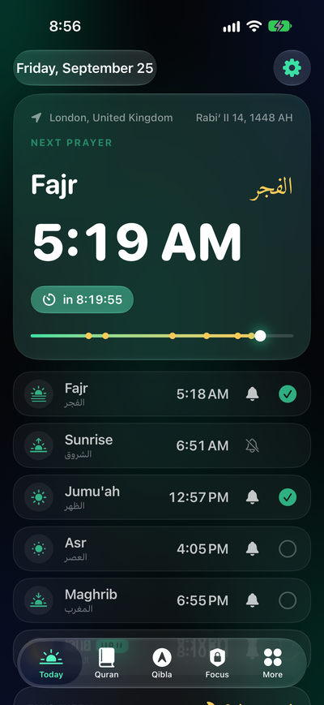
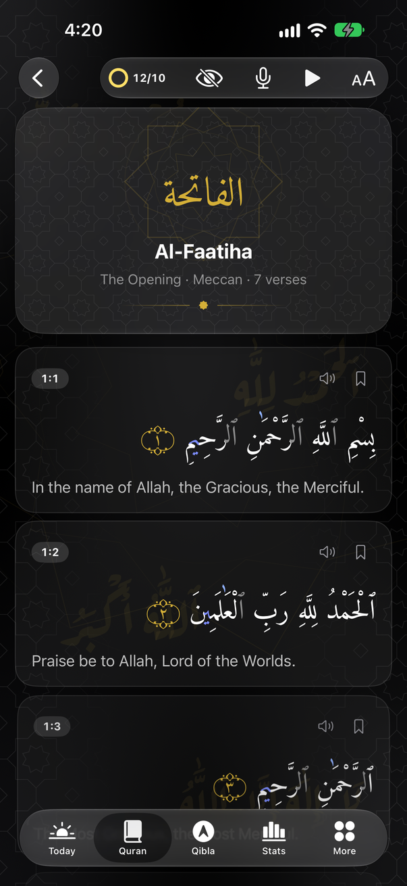
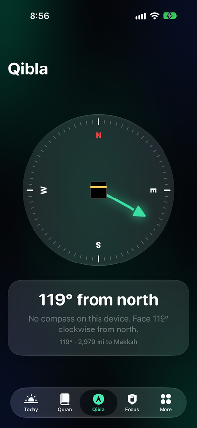
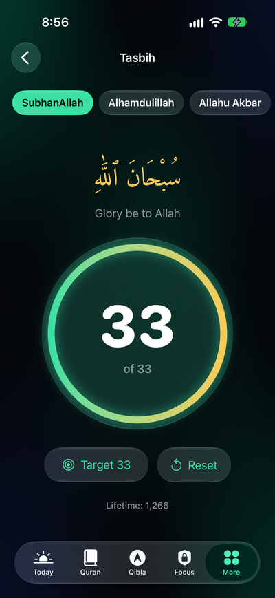

<p align="center">
  
</p>

<h1 align="center">Niyat · نيّة</h1>

<p align="center">
  <b>A free, open-source iOS companion for your deen.</b><br>
  Prayer times, adhan alerts, Quran, Qibla, widgets and Prayer Lock.<br>
  No ads. No subscriptions. No accounts. No tracking.
</p>

<p align="center">
  <a href="https://github.com/yusufashryy/niyatapp/actions/workflows/build.yml"></a>
  
  
  
</p>

<p align="center">
  
  
  
  
</p>

*Niyat* (نيّة) means intention. Actions are judged by their intentions.

Built with Apple's **Liquid Glass** design on iOS 26 and 27: a dark, high-contrast interface with glass controls floating over a deep emerald glow.

## Features

| | |
|---|---|
| 🕌 **Prayer times** | Calculated on-device for anywhere in the world (works offline). 12 calculation methods, Hanafi/Standard Asr, high-latitude rules, per-prayer minute adjustments. Picks a sensible method for your country automatically. |
| 🔔 **Adhan notifications** | Per-prayer on/off, optional "X minutes before" reminder, *Jumu'ah* on Fridays. |
| 📖 **Quran** | Full Arabic text (Uthmani script, Amiri Quran font) with English translation, fully offline. Search, bookmarks, "continue reading", adjustable text size. |
| 🧭 **Qibla compass** | Line the Kaaba up with the marker. Uses true north and your live GPS position, never spins when passing north, and shows compass accuracy. Verified against 20 cities in the tests. |
| 📱 **Widgets** | Next Prayer (Home Screen and all three Lock Screen styles), Prayer Times (medium/large), Verse of the Day, and an interactive Tasbih counter you can tap right on the Home Screen. |
| 🔒 **Prayer Lock** | Blocks the apps you choose (Instagram, TikTok, games…) at each adhan until you've had time to pray, with an "I've prayed" button to unlock early. Also does on-demand focus sessions. *Needs a paid Apple Developer account, see below.* |
| 🕰️ **Prayer dial** | Today is a 24-hour dial: the day's prayers around the ring, the daylight arc, and the sun or moon moving in real time. The screen's sky follows the time of day. |
| ✅ **Check-ins** | After each prayer's time begins: one tap for "on time", or mark it late, missed or excused with a reason (sleep, work, school…). |
| 📅 **Journey** | A calendar of your consistency, on-time rate, which prayer is hardest for you, and why prayers get late or missed. Tap any day to catch up or fix it. |
| 📿 **Tasbih** | Dhikr counter with targets (33/99/100…) and haptics. |
| 🌙 **Hijri date** | With ±2 day adjustment to match local moon sighting. |
| 🎨 **Themes** | Six colour themes (Midnight, Emerald, Desert, Amethyst, Maghrib, Onyx) or pick your own colours. Widgets follow your theme. |
| ✨ **Arabesque art** | Geometric Islamic star patterns, Ruqʿah calligraphy and sky scenes for each prayer, with haptics and smooth animations throughout (haptics can be turned off). |

## Running it on your iPhone

iOS apps can only be built on a **Mac** with **Xcode** installed. There's no way around this (Apple's rule). If you don't have a Mac, a friend's Mac or a cloud Mac such as MacinCloud works too.

### 1. One-time setup

1. Install **Xcode 26 or newer** (Xcode 27 recommended) from the Mac App Store. It's free and large, so give it a while.
2. Open Xcode once, accept the licence, and let it install the iOS components.
3. Install [Homebrew](https://brew.sh) if you don't have it, then in Terminal run:
   ```sh
   brew install xcodegen
   ```
   XcodeGen builds the Xcode project from `project.yml`, so the repo never has to store Xcode's messy project files.
4. In Xcode › Settings › Accounts, sign in with your Apple ID.

### 2. Get the code and set it up

```sh
git clone https://github.com/yusufashryy/niyatapp.git
cd niyatapp
make setup
```

`make setup` finds your Apple team ID, asks for an app ID prefix (the suggestion is fine), writes `Config/Local.xcconfig` and opens the project in Xcode. If you have a paid developer account, run `make full` afterwards to add Prayer Lock.

### 3. Run it on your iPhone

In Xcode, plug in your iPhone (or pick it from the device list at the top), then press **▶ Run**. The first time, your iPhone will ask you to:
- turn on **Developer Mode** (Settings › Privacy & Security › Developer Mode), and
- trust your developer certificate (Settings › General › VPN & Device Management).

> **Free vs paid Apple account**
> - **Free Apple ID**: everything except Prayer Lock works. Apple makes free-account apps expire after **7 days**, so you'll need to press Run again from Xcode once a week.
> - **Paid Apple Developer Program ($99/year)**: apps last a year, you get Prayer Lock (Apple only gives the Screen Time permission to paid accounts), and you could publish to the App Store for everyone.

To get the latest changes: `make update`, then press Run in Xcode. Tip: in Xcode › Window › Devices and Simulators, select your iPhone and tick **Connect via network** so you don't need the cable.

## How it's built

- **Swift + SwiftUI**, iOS 26+ (runs on iPhone 11 and newer), built with the iOS 27 SDK. Uses Liquid Glass (`glassEffect`, glass buttons, the shrinking tab bar). Native Swift is the only way to build iOS widgets and use Screen Time.
- **[Adhan](https://github.com/batoulapps/adhan-swift)** for the astronomical prayer time calculations (a well-tested library used by many prayer apps).
- **WidgetKit** for widgets, **App Intents** for the tappable tasbih widget.
- **FamilyControls / ManagedSettings / DeviceActivity** (Apple's Screen Time API) for Prayer Lock.
- Settings live in a shared **App Group** so the widgets and extensions can read them.

```
Niyat/             The app
  App/              Entry point, tab bar, AppModel (app-wide state)
  Features/         One folder per screen: Today, Quran, Qibla, Journey, Focus, Tasbih, Settings, Onboarding
  Services/         Location, notifications, background refresh, prayer tracker
  Resources/        Quran data, font, icons
Shared/             Code used by the app AND the widgets (prayer calculation, settings, models)
NiyatWidgets/      Home Screen & Lock Screen widgets
FocusShared/        Prayer Lock scheduling (Screen Time), shared with the extensions below
FocusMonitor/       Background extension that locks/unlocks apps at prayer times
FocusShield/        The "It's time for Dhuhr" screen shown over locked apps
NiyatTests/        Unit tests
project.yml         Project definition (XcodeGen). full-features.yml adds Prayer Lock.
```

If you know Luau: a SwiftUI `View` is like a component whose `body` describes the UI, and it re-renders automatically when the state it reads changes. `@Observable` classes such as `AppModel` are like a shared state module that UI subscribes to.

### Tests

Every push is built and tested by GitHub Actions on macOS 27 with Xcode 27 (`.github/workflows/build.yml`), in both the free and paid variants. The latest screenshots are on the [`demo-media`](https://github.com/yusufashryy/niyatapp/tree/demo-media) branch. Locally: press ⌘U in Xcode.

The `full` build also runs `NiyatUITests/DemoTour.swift`, which taps through every screen in a simulator and saves a screenshot of each (build artifact **demo**, also published to the `demo-media` branch).

## Accuracy

Getting these right matters more than anything else, so they're checked by automated tests on every build:

- **Quran text.** The bundled files must match the published SHA-256 checksums exactly (the app also re-checks this on launch and shows it in About). Every surah must have the standard Hafs verse count (6,236 in total), checked against a separately written list. The Bismillah is shown as a header above each surah (except Al-Fatiha, where it is verse 1, and At-Tawbah, which has none) rather than inside verse 1.
- **Qibla.** The app's bearing is checked against an independent great-circle calculation for 20 cities and a grid across the whole globe, and against published values (e.g. New York 58.48°, London 118.99°, Auckland 261.20°). On the phone, the compass uses true north (corrected for magnetic declination) and your live GPS position.
- **Prayer times.** Calculated with the well-tested [Adhan](https://github.com/batoulapps/adhan-swift) library. Tests cover ordering, Hanafi Asr, adjustments and high latitudes.

## Known limitations

- iOS only lets an app schedule 64 notifications, so adhan alerts are scheduled about 10 days ahead and topped up whenever the app opens. Open it at least once a week. It'll remind you.
- Notifications use the default iOS sound for now (no adhan audio yet).
- Prayer Lock can be turned off by the user in Settings. It's a tool for self-discipline, not a parental control.

## Roadmap ideas

- Adhan audio for notifications (needs a freely-licensed recording)
- Morning/evening adhkar
- More translations and languages (Urdu, Indonesian, Turkish, French…)
- Quran audio recitation
- Ramadan mode (suhoor/iftar times and countdown)
- Apple Watch app

Contributions are welcome! See [CONTRIBUTING.md](CONTRIBUTING.md).

## Credits & licences

The app's code is under the [MIT License](LICENSE). Bundled content keeps its own licence, listed in [docs/CREDITS.md](docs/CREDITS.md):

- Quran text: [Tanzil Project](https://tanzil.net), CC BY 3.0 (verbatim, unmodified)
- English translation: Talal Itani, [ClearQuran.com](https://clearquran.com), CC BY-ND 4.0
- Fonts: [Amiri Quran](https://github.com/aliftype/amiri) and [Aref Ruqaa](https://github.com/alif-type/aref-ruqaa), SIL Open Font License 1.1
- Prayer times: [Adhan](https://github.com/batoulapps/adhan-swift), MIT
