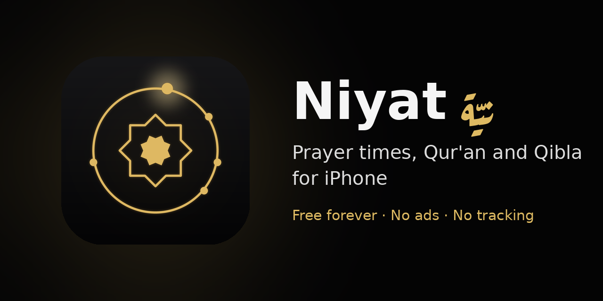
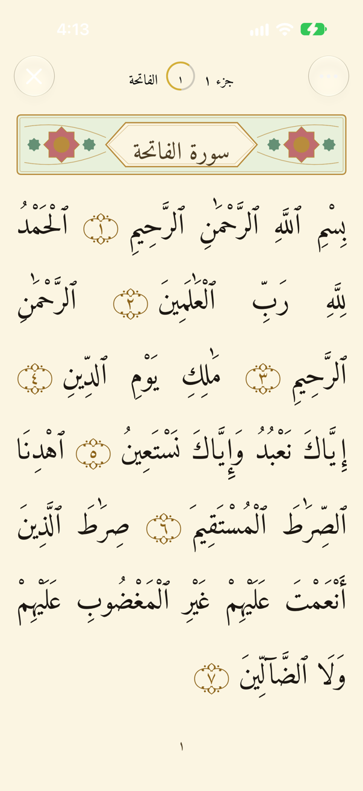
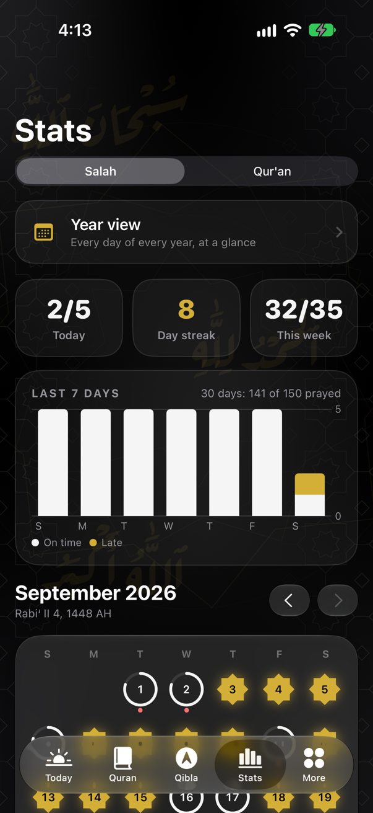
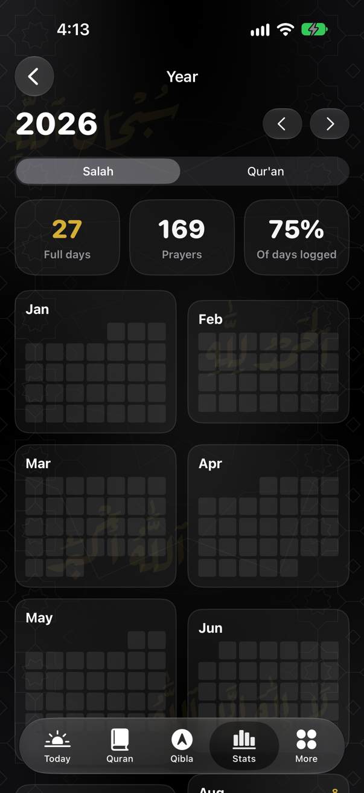

<p align="center">
  
</p>

<p align="center">
  <a href="https://github.com/yusufashryy/niyatapp/actions/workflows/build.yml"></a>
  
  
</p>

<p align="center">
  
  
  
</p>
<p align="center">
  
  
  
</p>

*Niyat* means **intention**. The app helps you keep your prayers and read the Qur'an every day.

## What it does

**Prayer**
- Accurate prayer times for anywhere, worked out on your phone (no internet needed)
- Choose your calculation method and Asr time (Standard or Hanafi)
- Alerts 30 or 10 minutes before, at the adhan, and 30 minutes after
- Log a prayer straight from the alert: press and hold, tap **Log Prayer**
- Check in each prayer as on time, late or missed, and note why

**Qur'an**
- The full Qur'an with an English translation, all offline
- Read verse by verse, or page by page like a printed mushaf (604 pages)
- Uthmani, simpler and modern scripts, plus the Warsh and Qalun readings
- Listen to 19 reciters, verse by verse, with no gaps between verses
- A daily goal in ayat with a streak
- Reminders: morning, afternoon, streak, verse of the day, and Surah Al-Kahf on Fridays

**Stats**
- A calendar of how consistent you've been, month by month and year by year
- Which prayers you miss most, and why
- Qur'an streaks and an estimate of the reward (clearly marked as an estimate)

**And more**
- Qibla compass with true north and a gentle tap when you face the Qibla
- 10 widgets for the Home Screen and Lock Screen
- Tasbih counter, Hijri date, themes
- Groups: keep each other on track with family and friends (uses iCloud)
- Prayer Lock: locks distracting apps at prayer time (needs a paid Apple developer account)

## Accuracy

Getting this right matters most.

- **Qur'an text** comes from the [Tanzil Project](https://tanzil.net) and is never changed. The app checks every file against its published fingerprint (checksum), and the tests check all 6,236 verses.
- **Qibla** is tested against 20 cities and an independent calculation.
- **Prayer times** use the well-tested [Adhan](https://github.com/batoulapps/adhan-swift) library.

Every source is listed in [docs/SOURCES.md](docs/SOURCES.md).

## Privacy

Everything stays on your iPhone. There is no Niyat server and nothing is collected. Read the [privacy policy](docs/privacy.md).

## Put it on your iPhone

You need a **Mac** with **Xcode** (free from the Mac App Store).

1. Install XcodeGen once: `brew install xcodegen` (get Homebrew from [brew.sh](https://brew.sh))
2. In Xcode › Settings › Accounts, sign in with your Apple ID
3. In Terminal:
   ```sh
   git clone https://github.com/yusufashryy/niyatapp.git
   cd niyatapp
   make setup
   ```
4. Plug in your iPhone, pick it at the top of Xcode, and press **▶ Run**

The first time, your iPhone asks you to turn on **Developer Mode** (Settings › Privacy & Security) and to trust the app (Settings › General › VPN & Device Management).

To get updates later: `make update`, then press **▶ Run** again.

With a free Apple ID the app works for 7 days, then press Run again. With a paid developer account ($99/year) it lasts a year, and `make full` adds Prayer Lock, Groups and Time Sensitive alerts.

## Support

Niyat is free and always will be. If it helps you, you can leave an optional tip in the app (More › Support Niyat) to help cover the cost of being on the App Store.

Found a bug or have an idea? Use **More › Send feedback** in the app, or [open an issue](https://github.com/yusufashryy/niyatapp/issues).

## For developers

Swift and SwiftUI, iOS 26+, Liquid Glass. Every push is built and tested on GitHub Actions. See [CONTRIBUTING.md](CONTRIBUTING.md).

| Folder | What's in it |
|---|---|
| `Niyat/` | The app |
| `Shared/` | Code shared by the app and its widgets |
| `NiyatWidgets/` | Home Screen and Lock Screen widgets |
| `FocusShared/`, `FocusMonitor/`, `FocusShield/` | Prayer Lock |
| `NiyatTests/` | Tests |
| `docs/` | Sources, credits, privacy policy, App Store listing |

## Credits

The code is under the [MIT License](LICENSE). Content keeps its own licence (details in [docs/CREDITS.md](docs/CREDITS.md)):

- Qur'an text: [Tanzil Project](https://tanzil.net), CC BY 3.0
- Warsh and Qalun: [Qur'anpedia](https://quranpedia.net)
- English translation: Talal Itani, [ClearQuran.com](https://clearquran.com), CC BY-ND 4.0
- Recitation audio: [Islamic Network](https://islamic.network), free for non-commercial use
- Fonts: [Amiri Quran](https://github.com/aliftype/amiri) and [Aref Ruqaa](https://github.com/alif-type/aref-ruqaa), SIL Open Font License
- Prayer times: [Adhan](https://github.com/batoulapps/adhan-swift), MIT
