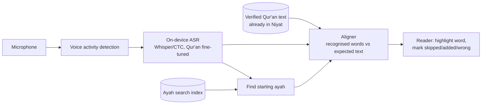

# Recitation checker: feasibility report

**Status: research only. Nothing here is implemented in Niyat.**

Goal: a mode, similar in concept to Tarteel, where the user turns on the microphone, recites, and the app follows along and flags mistakes.

## Summary

- **Feasible in stages.** The key simplification: we almost always know *what* the user is trying to recite. That turns open-ended speech recognition into **matching audio against a known text**, which is much easier and more accurate.
- **On-device first.** Modern iPhones can run a Whisper-class model on the Neural Engine in near real time. Recordings then never leave the phone, there's no server cost, and it works offline.
- **What works reliably:** following along word by word, recognising which ayah someone started from, and catching skipped, added and wrong words.
- **What doesn't yet:** detailed tajwid and pronunciation checking (makharij, ghunnah length, madd counts). This is research-grade everywhere, needs expert-labelled audio that barely exists openly, and should be treated as a later, separate project.

## Why this is easier than general speech recognition

General Arabic speech recognition has to guess from an open vocabulary, in many dialects. Recitation is different:

1. The text is fixed and fully known (6,236 ayat, about 77,000 words).
2. The user is usually reading along from a known position.
3. Pronunciation follows rules, not dialect.

So the system only needs to answer: *does this audio match the expected words, and where does it diverge?* That's **alignment**, not transcription.

## Component by component

| Capability | Feasibility | How |
|---|---|---|
| Follow along (highlight current word) | **High** | Streaming recognition + alignment to the expected verse text |
| Recognise which ayah was started | **High** | Transcribe the first few seconds, fuzzy-search an index of the Qur'an text |
| Skipped words | **High** | Words in the expected text with no match in the alignment |
| Added / repeated words | **High** | Recognised words with no place in the expected text; repetition is a known pattern (restarting a phrase) and should be allowed, not flagged |
| Wrong word (substitution) | **Medium-high** | Alignment mismatch, with a confidence threshold to avoid false alarms |
| Wrong harakah (vowel) | **Medium** | Needs a model that outputs vocalised text or phonemes; plain Whisper often drops vowels |
| Pauses (waqf) | **Medium** | Voice-activity detection gives pause positions; judging whether a stop is *permitted* needs waqf marks (in the Uthmani text) and rules |
| Tajwid rules (madd, ghunnah, idgham, ikhfa, qalqalah) | **Low today** | Needs phoneme-level acoustic models trained on expert-labelled recitation. Small academic datasets exist; not production-ready |
| Makharij / pronunciation quality | **Low today** | Same as above; also sensitive to accent and microphone |
| Different accents | **Medium** | Models trained mostly on professional reciters struggle with beginners, children and strong accents; needs diverse training data |
| Different qira'at | **Medium** | Requires the matching text (Niyat already bundles Warsh and Qalun) and ideally audio training data per riwayah. Start with Hafs only |

## Models, APIs and data (to be verified hands-on before committing)

**On-device models**

- **Whisper** (OpenAI, MIT licence). It is multilingual and includes Arabic. General Arabic Whisper is weak on Qur'anic recitation out of the box, but fine-tunes exist.
- **Qur'an fine-tuned Whisper models** published on Hugging Face, for example by Tarteel (e.g. `tarteel-ai/whisper-base-ar-quran`). Check each model's licence and evaluation before use.
- **WhisperKit** (Argmax, MIT). Runs Whisper models on Apple silicon via Core ML. Streaming support makes it a strong candidate for iOS.
- **wav2vec 2.0 / XLS-R** (Meta, Apache 2.0) with a CTC head, fine-tuned on Qur'anic audio. CTC models stream naturally and give frame-level timings, which is ideal for word alignment and later phoneme work.
- **Apple Speech framework.** Apple's newer on-device speech APIs are general-purpose transcription. Arabic coverage and quality on recitation must be tested; they're unlikely to handle harakat or tajwid.

**Cloud APIs** (Google, Azure, AWS speech-to-text) support Modern Standard Arabic but aren't tuned for recitation. They'd need audio to leave the device and they cost per minute. Not recommended as the main path.

**Training and evaluation data.** Checking a model's accuracy needs labelled audio.
- Professional per-ayah recitations (as used by EveryAyah-style collections) are plentiful. Their licences are often unclear, so check each source.
- Tarteel has built large crowd-sourced datasets. Public availability varies.
- Small academic tajwid datasets exist (e.g. QDAT). They're useful for research, not enough for production.

Whatever data is used, keep a provenance record like `docs/CREDITS.md` does for text and audio.

## Accuracy to expect

These are rough ranges to validate, not promises:
- **Following along:** fine-tuned models on clear recitation typically reach low word-error rates, so tracking is reliable.
- **Mistake flags:** false alarms are the main risk. Flagging a correct recitation as wrong is worse than missing a mistake, especially for learners. Tune for high precision, and show mistakes as gentle suggestions to double-check, never as a verdict.
- **Tajwid:** not reliable enough to show users today.

## On-device vs server

| | On-device (recommended) | Server |
|---|---|---|
| Privacy | Audio never leaves the phone | Recordings uploaded; needs consent, retention policy, security |
| Cost | None per use | GPU inference per minute of audio |
| Offline | Yes | No |
| Latency | Low (no network) | Network round trip, plus queueing |
| Model size | Limited (tens to low hundreds of MB) | Unlimited |
| Updating models | App update or on-demand download | Instant |

Recitation audio is personal and religious. Keeping it on the device is the right default. A server would only be justified for heavy tajwid models later, and then only opt-in.

## Recommended architecture

- **Audio:** `AVAudioEngine` captures 16 kHz mono and a voice-activity detector drops silence.
- **Recognition:** streaming inference in 1–2 second windows with overlap.
- **Aligner:** normalises Arabic (so orthographic variants still match), then aligns word sequences with an edit-distance algorithm and applies confidence thresholds. This is plain Swift and can be unit-tested against the bundled text.
- **UI:** reuses the existing reader. The current word is highlighted, and issues are shown as subtle underlines with a "listen to the correct recitation" button using the existing reciter audio.

## Roadmap

1. **Spike (2–3 weeks):**
   - Run WhisperKit with 2–3 candidate Qur'an models on-device.
   - Measure word error rate on 50–100 held-out recitations (professional and amateur) and latency on an iPhone 12 or newer.
   - Check licences.
2. **Follow-along (4–6 weeks):**
   - Microphone mode in the reader with live word highlighting and ayah auto-detection.
   - No mistake flags yet.
3. **Word-level mistakes (4–6 weeks):**
   - Skipped, added and wrong words, tuned for few false alarms.
   - Beta with a small group, including teachers.
4. **Harakat (research):** evaluate vocalised-output or phoneme models.
5. **Tajwid (research, optional):** only with qualified reciters labelling data and reviewing results. Probably a separate model, possibly server-assisted and opt-in.

## Costs

- **On-device:** no running cost.
  - Engineering time is the main cost.
  - Model download size: plan for an on-demand download of about 75–250 MB, rather than bundling it.
- **Server (if ever needed):** per-minute GPU cost, plus storage, security, and a privacy policy that covers audio. Only worth it for the tajwid stage.

## Open questions

- Licences of the candidate fine-tuned models and any training data.
- Accuracy for children, beginners and non-Arab accents.
- Whether to support Warsh/Qalun recitation checking (needs riwayah-specific data).
- How teachers would want mistakes shown (immediately, or a summary at the end).
